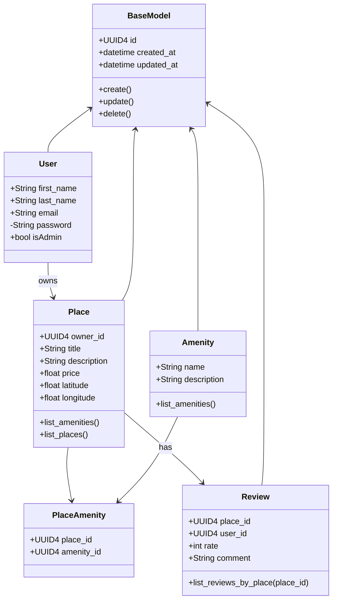

### High-Level Architecture - classDiagram

```mermaid
classDiagram

class BaseModel {
    +UUID4 id
    +datetime created_at
    +datetime updated_at
    +create()
    +update()
    +delete()
}

class User {
    +String first_name
    +String last_name
    +String email
    -String password
    +bool isAdmin
}

class Place {
    +UUID4 owner_id
    +String title
    +String description
    +float price
    +float latitude
    +float longitude
    +list_amenities()
    +list_places()
}

class Review {
    +UUID4 place_id
    +UUID4 user_id
    +int rate
    +String comment
    +list_reviews_by_place(place_id)
}

class Amenity {
    +String name
    +String description
    +list_amenities()
}

class PlaceAmenity {
    +UUID4 place_id
    +UUID4 amenity_id
}

BaseModel <-- User
User --> Place : owns
Place --> PlaceAmenity : 
Place --> Review : has
BaseModel <-- Place
BaseModel <-- Review
BaseModel <-- Amenity
Amenity --> PlaceAmenity

```

