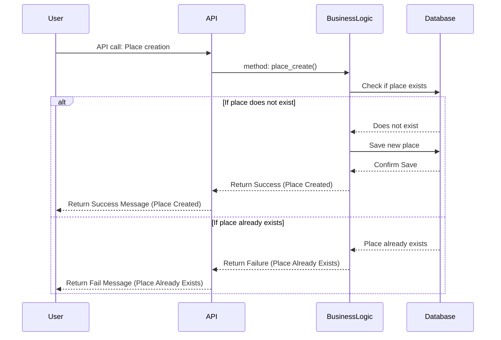

```mermaid
sequenceDiagram
participant User
participant API
participant BusinessLogic
participant Database

User->>API: API call: Place creation
API->>BusinessLogic: method: place_create()
BusinessLogic->>Database: Check if place exists

alt If place does not exist
    Database-->>BusinessLogic: Does not exist
    BusinessLogic->>Database: Save new place
    Database-->>BusinessLogic: Confirm Save
    BusinessLogic-->>API: Return Success (Place Created)
    API-->>User: Return Success Message (Place Created)
else If place already exists
    Database-->>BusinessLogic: Place already exists
    BusinessLogic-->>API: Return Failure (Place Already Exists)
    API-->>User: Return Fail Message (Place Already Exists)
end

```