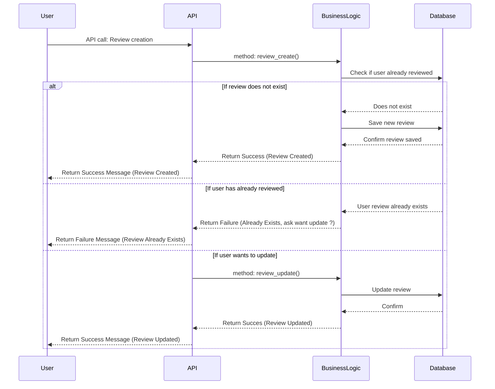

```mermaid
sequenceDiagram
participant User
participant API
participant BusinessLogic
participant Database

User->>API: API call: Review creation
API->>BusinessLogic: method: review_create()
BusinessLogic->>Database: Check if user already reviewed

alt If review does not exist
    Database-->>BusinessLogic: Does not exist
    BusinessLogic->>Database: Save new review
    Database-->>BusinessLogic: Confirm review saved
    BusinessLogic-->>API: Return Success (Review Created)
    API-->>User: Return Success Message (Review Created)

else If user has already reviewed
    Database-->>BusinessLogic: User review already exists
    BusinessLogic-->>API: Return Failure (Already Exists, ask want update ?)
    API-->>User: Return Failure Message (Review Already Exists)

else If user wants to update
    API->>BusinessLogic: method: review_update()
    BusinessLogic->>Database: Update review
    Database-->>BusinessLogic: Confirm
    BusinessLogic-->>API: Return Succes (Review Updated)
    API-->>User: Return Success Message (Review Updated)
end 
```