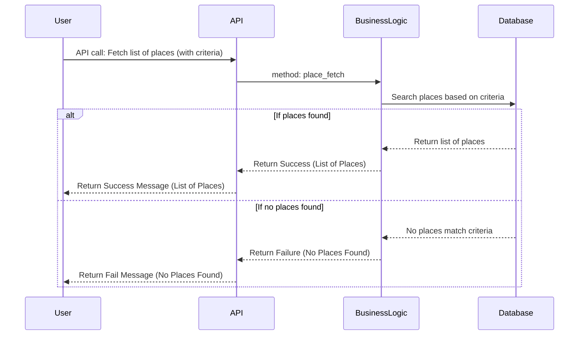

```mermaid
sequenceDiagram
participant User
participant API
participant BusinessLogic
participant Database

User->>API: API call: Fetch list of places (with criteria)
API->>BusinessLogic: method: place_fetch
BusinessLogic->>Database: Search places based on criteria

alt If places found
    Database-->>BusinessLogic: Return list of places
    BusinessLogic-->>API: Return Success (List of Places)
    API-->>User: Return Success Message (List of Places)
else If no places found
    Database-->>BusinessLogic: No places match criteria
    BusinessLogic-->>API: Return Failure (No Places Found)
    API-->>User: Return Fail Message (No Places Found)
end
```