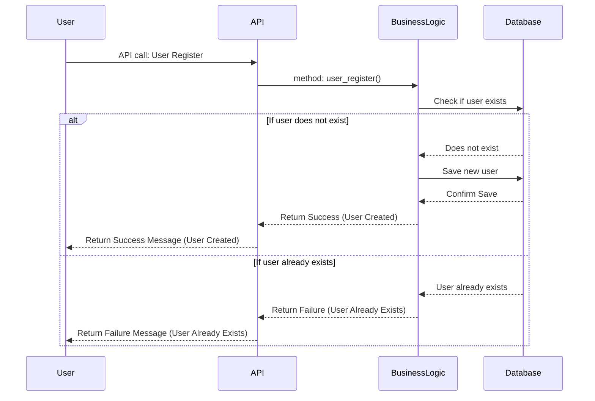

```mermaid
sequenceDiagram
participant User
participant API
participant BusinessLogic
participant Database

User->>API: API call: User Register
API->>BusinessLogic: method: user_register()
BusinessLogic->>Database: Check if user exists

alt If user does not exist
    Database-->>BusinessLogic: Does not exist
    BusinessLogic->>Database: Save new user
    Database-->>BusinessLogic: Confirm Save
    BusinessLogic-->>API: Return Success (User Created)
    API-->>User: Return Success Message (User Created)

else If user already exists
    Database-->>BusinessLogic: User already exists
    BusinessLogic-->>API: Return Failure (User Already Exists)
    API-->>User: Return Failure Message (User Already Exists)
end

```