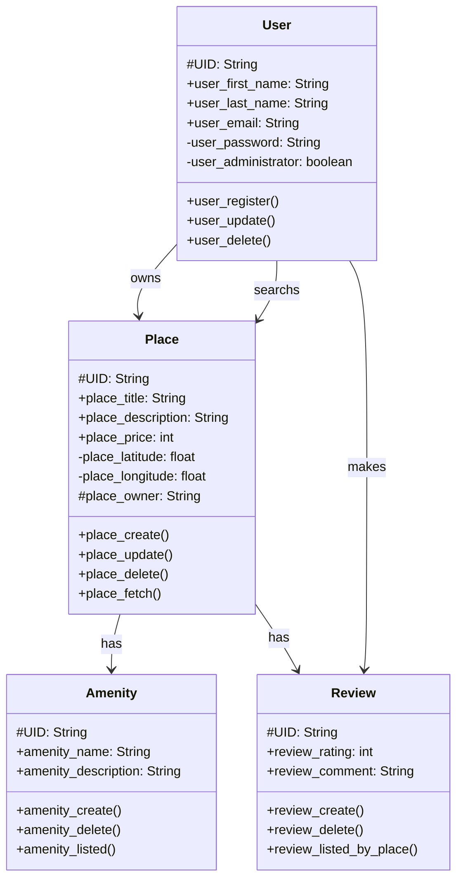

# 🏠 HBnB Project – Documentation  

## 📌 Introduction  

### 🎯 Objectif  
Ce document fournit un plan détaillé pour l’application **HBnB Evolution**. Il consolide tous les diagrammes et notes explicatives en une référence technique complète, guidant les phases de mise en œuvre et clarifiant l’architecture et la conception du système.  

### 📍 Portée du Projet  
**HBnB Evolution** est une application simplifiée inspirée d’Airbnb qui permet aux utilisateurs de :  
✔️ S’inscrire 🔑  
✔️ Ajouter des propriétés 🏡  
✔️ Associer des commodités 🏕️  
✔️ Soumettre des avis ⭐  

Cette documentation couvre :  
📂 **L’architecture générale** (diagramme de packages)  
🛠 **Le modèle métier** (diagramme de classes détaillé)  
🔄 **Les interactions API** (diagrammes de séquence)  

---

## 🏗️ Architecture Générale  

### 🔍 **Diagramme de Packages**  
L’architecture suit un **modèle en couches**, intégrant le **facade pattern** pour simplifier les interactions entre les composants.  

````mermaid
classDiagram
class Presentation {
    +Services
    +API endpoints
}
class BusinessLogic {
    <<Core Models>>
    +User
    +Place
    +Review
    +Amenity
}
class Persistence {
    +Database
    +Repository
    +data_save()
    +data_fetch()
}

Presentation --> BusinessLogic : Facade Pattern
BusinessLogic --> Persistence : Database Access
````

📌 **Les 3 couches principales** :  

1️⃣ **Presentation Layer** 🎨  
- Gère l’interface utilisateur et les interactions.  
- Reçoit les requêtes et renvoie les réponses après traitement.  

2️⃣ **Business Logic Layer** ⚙️  
- Contient les modèles clés (**User, Place, Review, Amenity**).  
- Implémente les règles métier et orchestre les opérations.  
- Sert de **facade** pour la communication avec la couche persistance.  

3️⃣ **Persistence Layer** 🗄️  
- Gère la base de données et les opérations CRUD.  
- Structure les données pour assurer intégrité et cohérence.  

### High-Level Architecture - classDiagram

Presentation --> BusinessLogic : Facade Pattern
BusinessLogic --> Persistence : Database Access

Le **facade pattern** permet à la **Presentation Layer** de ne jamais interagir directement avec la base de données, assurant une meilleure modularité et maintenabilité.  

---

## 🛠️ Business Logic Layer  


### 📌 **Diagramme de Classes**  
Le cœur de l’application repose sur plusieurs **entités clés** :  

### High-Level Architecture - classDiagram



- **User** 👤  
  📌 `id`, `first_name`, `last_name`, `email`, `password`  
  🛠 `register()`, `update_profile()`, `delete_account()`  

- **Place** 🏡  
  📌 `id`, `title`, `description`, `price`, `latitude`, `longitude`, `createdAt`, `updatedAt`  
  🛠 `create()`, `update()`, `delete()`  

- **Review** ⭐  
  📌 `id`, `user_id`, `place_id`, `rating`, `comment`, `createdAt`, `updatedAt`  
  🛠 `submit()`, `update()`, `delete()`  

- **Amenity** 🏕️  
  📌 `id`, `name`, `description`, `createdAt`, `updatedAt`  
  🛠 `add()`, `update()`, `delete()`  

### 🔗 **Relations entre les Entités**  
✔️ **Un utilisateur** peut posséder plusieurs **places** et laisser plusieurs **avis**.  
✔️ **Un lieu** peut recevoir plusieurs **avis** et être associé à plusieurs **commodités**.  

L’architecture de la couche métier garantit **cohérence, évolutivité et modularité**.  

---

## 🔄 API Interaction Flow  

### 📊 **Diagrammes de Séquence pour les appels API**  

````mermaid
sequenceDiagram
    participant User
    participant PresentationLayer
    participant BusinessLogicLayer
    participant PersistenceLayer

    User->>PresentationLayer: Register User
    PresentationLayer->>BusinessLogicLayer: Validate and transform data
    BusinessLogicLayer->>PersistenceLayer: Store user data
    PersistenceLayer-->>BusinessLogicLayer: Confirmation
    BusinessLogicLayer-->>PresentationLayer: Response
    PresentationLayer-->>User: Registration success msg/error msg

    User->>PresentationLayer: Create Place
    PresentationLayer->>BusinessLogicLayer: Validate place data
    BusinessLogicLayer->>PersistenceLayer: Insert place data
    PersistenceLayer-->>BusinessLogicLayer: Confirmation
    BusinessLogicLayer-->>PresentationLayer: Response
    PresentationLayer-->>User: Place creation success/failed

    User->>PresentationLayer: Submit Review
    PresentationLayer->>BusinessLogicLayer: Validate review data
    BusinessLogicLayer->>PersistenceLayer: Save review data
    PersistenceLayer-->>BusinessLogicLayer: Confirmation
    BusinessLogicLayer-->>PresentationLayer: Response
    PresentationLayer-->>User: Review submitted/failed

    User->>PresentationLayer: Request List of Places
    PresentationLayer->>BusinessLogicLayer: Fetch places
    BusinessLogicLayer->>PersistenceLayer: Retrieve place data
    PersistenceLayer-->>BusinessLogicLayer: Places data
    BusinessLogicLayer-->>PresentationLayer: List of Places
    PresentationLayer-->>User: Display list of places
````

#### 📝 **1. Inscription de l’Utilisateur**  
1️⃣ L’utilisateur envoie ses informations (**nom, email, mot de passe**) à la **Presentation Layer**.  
2️⃣ Celle-ci les valide et les transmet à la **Business Logic Layer**.  
3️⃣ Après validation, les données sont enregistrées via la **Persistence Layer**.  
4️⃣ Une réponse de succès ou d’échec est renvoyée.  

#### 🏡 **2. Création d’un Lieu**  
1️⃣ L’utilisateur soumet une demande de création (**titre, description, etc.**).  
2️⃣ La **Presentation Layer** transmet la requête à la **Business Logic Layer**.  
3️⃣ Après validation, les données sont insérées via la **Persistence Layer**.  
4️⃣ Une confirmation est retournée.  

#### ⭐ **3. Soumission d’un Avis**  
1️⃣ L’utilisateur veut laisser un avis sur un lieu.  
2️⃣ La **Presentation Layer** envoie les détails (**note, commentaire, etc.**) à la **Business Logic Layer**.  
3️⃣ L’avis est enregistré via la **Persistence Layer**, puis une réponse est renvoyée.  

#### 📍 **4. Récupération des Lieux Disponibles**  
1️⃣ L’utilisateur demande la liste des lieux disponibles.  
2️⃣ La **Presentation Layer** interroge la **Business Logic Layer**, qui consulte la **Persistence Layer**.  
3️⃣ Les résultats sont renvoyés et affichés à l’utilisateur.  

---

## 📌 Conclusion  

Ce document est un **guide technique complet** pour **HBnB Evolution**. Il fournit :  

📂 **Un aperçu de l’architecture** et du **facade pattern** 🏗️  
📊 **Un modèle métier structuré** avec un diagramme de classes 🔍  
🔄 **Un schéma d’interaction API** détaillant les principales opérations  

🔹 **Lisibilité et professionnalisme** assurent une compréhension claire pour les développeurs tout au long de l’implémentation.  
🔹 Ce document évoluera pour refléter les mises à jour du projet.  

📌 **HBnB Evolution : Construisons ensemble un Airbnb simplifié et efficace !** 🚀🏡  

