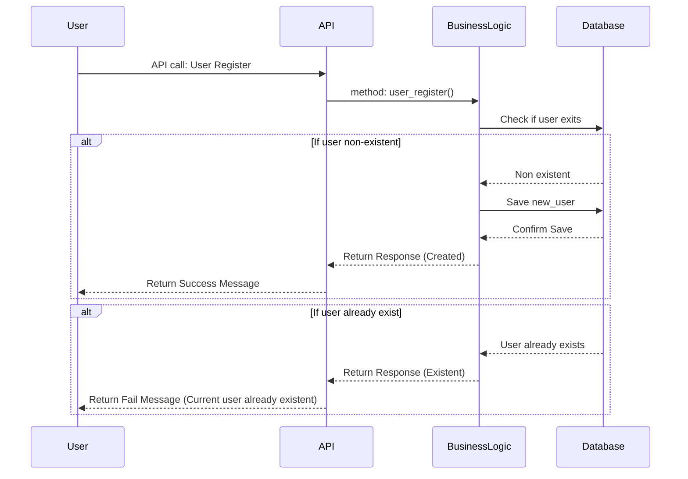

```mermaid
sequenceDiagram
participant User
participant API
participant BusinessLogic
participant Database

User->>API: API call: User Register
API->>BusinessLogic: method: user_register()
BusinessLogic->>Database: Check if user exits
alt If user non-existent
Database-->>BusinessLogic: Non existent
BusinessLogic->>Database: Save new_user
Database-->>BusinessLogic: Confirm Save
BusinessLogic-->>API: Return Response (Created)
API-->>User: Return Success Message
end
alt If user already exist

Database-->>BusinessLogic: User already exists
BusinessLogic-->>API: Return Response (Existent)
API-->>User: Return Fail Message (Current user already existent)
end
```
